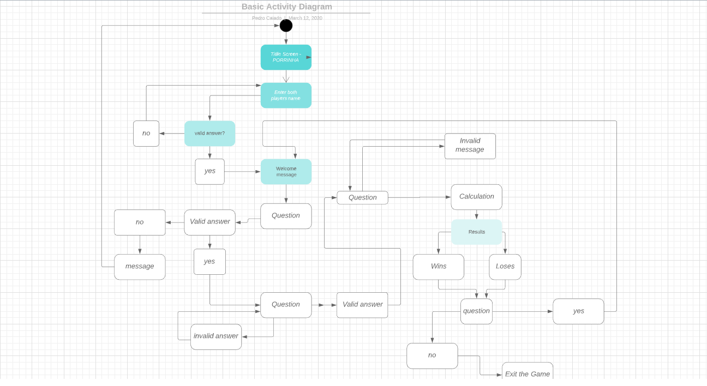

                                                        TERMINAL APPLICATION – PORRINHA

Application Development Plan 

First of all, before starting a project, an idea must be created, and developed, so the developer has a broad view of the line of action to be taken. This line of crossing will be a goal to be reached, and also a reduction in the expensive hourly work, as well as salary, if necessary, by the employer.
Regardless of the purpose of the project, it like everything else, will have goal set before start building it, which will be followed by a beginning, a middle and an end.
The project developed has followed the bellow criteria.
-	An idea implemented by the developer;
-	Define the requirements for the project;
-	Assess the feasibility of the project;
-	Document all procedures;
-	Choose the development methodology;
-	Code implementation;
-	Articles and websites researches;
-	Priority settings
-	Testing the application while elaborating the Code;
-	Application testing;
-	Workbook has been done together while the application was processed by the developer;
-	Project closure;

Purpose and scope

Porrinha is a game implemented in Brazil. Several people play this game in order to have fun and distraction. It is worth mentioning that the game has been used in the daily lives of each person. The game, has greater visibility and it’s used in city bars.
The purpose of developing this application is to make people not only use the game in city bars, but also in their daily lives. As it is not a game much sought by society in general, people do not use that game directly. The intention, then, was to create this application so that people have a broader access to it. 
Over the years, the internet, like the means of communication, has developed extremely fast and effectively, making access to technological information more accessible to the general public. Therefore, this game can then be accessed through the internet, thus generating credibility and, also, greater visibility to the game mentioned above.
As mentioned, and, also to finalize the point in question, it is clear that the purpose of the game is to reach the collective environment in general, not being so, restricted to only one country or only part of the society. 
So, people can use this application on their computer while taking a break from work, study or to have some fun with a friend or a group of friends.
The game has different features. It can be played by two players, which makes even more fun and greater, as the user can play with a friend or acquaintance.
As soon as the game finishes, player is asked by the computer if they would like to play again. Players will be able to choose if they would like to start the game again. As the game has already started, the game was created by a while loop and a variable called play_again. The while loop starts the game from where the game asks the player to choose their sticks. It has been done, considering the same players will be continuing on playing.
All the variables have been identified while making the game. The players, guesses, play again, restart the game have been codified for the correctly so the game won’t  have any issues while playing it.
Another important future is the development of knowledge in numeracy and, also, of logic involving numbers.
As it is a game that involves logical reasoning, as well as mathematics, this makes it a healthy game that will improve anyone's reasoning.
Another important feature is the input method, in which the user can share personal data, such as the name.
Finally, last but not least impotent. It is the feature in which the player will be able to interact with the computer, since the computer will utilise outputs, placing messages on the computer screen, either through questions, statements and also answers.

Interaction and Experience for the Application

In the game in question, it is worth mentioning that the user will have access to the means of installing the game (explained separately in another document).
The players can have access to the Flow Diagram, click on the link below.

The rules to be followed by the user and also the instructions is explained with details below.
WHAT NEEDS IN THE GAME? 
-	6 sticks, being 3 sticks for each player;
-	Players will have to drink before starting the game;
-	Can be played anywhere, usually occurs in the (bar) and also, when there is nothing else to talk about or to do;
TRUE FACTS AND SAFETY PRECAUTIONS 

•	Used to be played with matchsticks but the losers were burning the bar afterwards.
•	Reason why is recommended small sticks.
RULES. HOW IS IT PLAYED?
-	2 players;
-	Player_1 starts the game, which will be asked to type their name.
-	Player_2 two will be asked to type their name after player_1.
-	Each player has 3 sticks;
-	Computer will ask the number of sticks that players want to choose.
-	Players can CHOOSE to have from 0 to 3 sticks; (type number when asked)
-	Then Player_1 will have to guess the SUM OF STICKS in HIS hand + the OTHER PLAYER’S hand, choosing a number from 0 to 6;
-	Then, the second player_2 will choose a number from 0 to 6;
-	Whoever guess correctly the SUM OF STICKS in both player’s hand, will win the round;
-	The game keeps on going till one of the players have no sticks left in their hands;

Diagram – Control Flow on application

Implementation Plan

For the implementation of the application, it was necessary to use basic and advanced knowledge of each material studied in class. Not all the materials taught in the class were applied in the development of the project, even though was necessary to know the existence of each one, facilitating the research and also in the methods applied for the creation of the game
The knowledge of how to use the terminal was essential for the development of the game and also for its creation. Considering that, throughout the terminal folders, files, checks were done.
The project, partly in coding, required the use of research and knowledge in data types, flow control, loops, methods, gems, git, design, TDD, error handling and trello.
The program was coded according to the need of the game. Using specific materials for each part of the project.
When starting the game, players are greeted with a message for whom they identify. For the program to make this communication with the user, it was necessary to use the creation of a "method", and within the method, use the "input", where the player can exercise his identification using his name. Within this "method", use a "while loop" as well as an "IF" statement. It is worth mentioning that this method describes an argument, so that the program can be called to run correctly. In the game was also implemented within this "method" and the invalidity of the user left the space blank when asked for his identification. Therefore, identification is necessary.
Then, the user will be received by the computer with the name that was identified in the previous part. It is worth mentioning, in this greeting by the computer, a “GEM”, “colorized” was utilised. This "gem" was applied to entertain players. It was necessary to create a "require”, so that the program fully understands its usefulness. The “gem was copied by the github website.
After answering a question asked by the computer, the player will be directed to the game. If the user has not followed the necessary requirements to play, he will be exited from the game. (check game requirements).
If the player has followed the requirements for the game, he will be taken to the next part of the game, which was performed using “input” / “output”. Although, for this part of the game it was required to utilise an extra feature – player will type a number of sticks chosen and the number won’t appear on the screen. It was done so the opponent in the game will not be able to see what’s been typed. It was necessary to use input = STDIN.noecho (&: gets) .chomp.to_i. As the number typed has to be an integer, it was converted to integer as seeing above.
It was also used, the “system (‘ clear ”), so that the player has the comfort of organization in the game having a clear screen while playing.
After finish the game, it was necessary to create a variable and also “input”, so the player is asked to play again. This variable was named "play_again". A variable was used outside the “method”, so the user can choose whether he wants to play again or end the game.

To make sure that all the instructions warer followed step by step and to keep all the material and concpets organised, was used the a web site called trello. In case the link is provided below.
https://trello.com/b/FYjjl2E2/porrinha

Install Application

To perform the application, the only requirement is to have a ruby version greater than or equal to 1.9
On the terminal, or WSL type. Then, follow the prompts 
Ruby porrinha.rb
All computers can have access to the game. To have a better quality it’s recommended a Mac, linux or Windows at least year 2016.

Referenced sources

 - <a href=“https://rubygems.org/gems/colorize”>colorize
</a>

 - <a href=“https://rubygems.org/gems/tty-font”>tty-font
</a>

 - <a href=“https://rubygems.org/gems/pastel”>pastel
</a>

- https://coderacademy.instructure.com/courses/290

- https://github.com/Pedro-Caiado

- https://stackoverflow.com/

- https://trello.com/b/FYjjl2E2/porrinha

- https://rubygems.org/gems